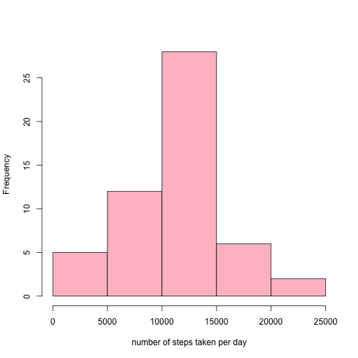
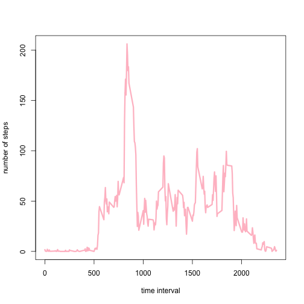
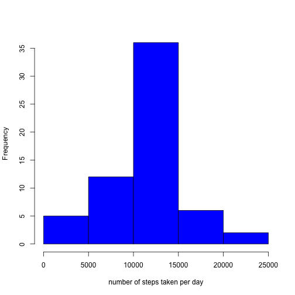
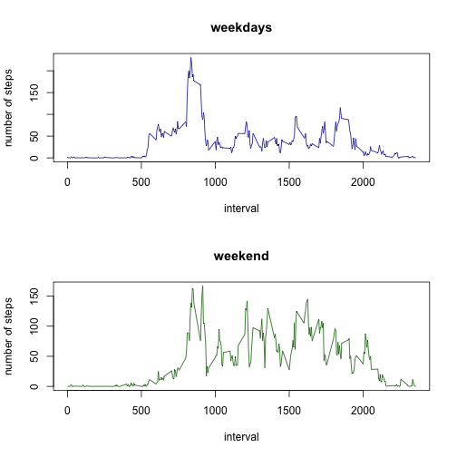

## Loading and preprocessing the data


```r
D <- read.csv("activity.csv")
D$date <- as.Date(D$date,format="%Y-%m-%d")
D2 <- D[complete.cases(D),]
```

## What is mean total number of steps taken per day?


```r
steps.sum <- tapply(D2$steps,D2$date,sum)
hist(steps.sum,main="",xlab="number of steps taken per day",col="pink")
```

 

The mean number of steps/day is 1.0766 &times; 10<sup>4</sup>.   
The median number of steps/day is 10765.

## What is the average daily activity pattern?

```r
steps.ave <- tapply(D2$steps,D2$interval,mean)
plot(as.numeric(names(steps.ave)),steps.ave,main="",xlab="time interval",ylab="number of steps",col="pink",type="l",lwd=3)
```

 

The interval 835 has the maximum number of steps.

## Imputing missing values  
There are 2304 cases with missing values.    

First we create a new dataset where the NAs are replaced with the mean value of the same time interval.


```r
D3 <- D
for (r in 1:nrow(D3)){
  if (is.na(D3$steps[r])){
    D3$steps[r] <- steps.ave[names(steps.ave)==D3$interval[r]]
  }
}
```

Then we plot the histogram as before:  

```r
steps.sum.im <- tapply(D3$steps,D3$date,sum)
hist(steps.sum.im,main="",xlab="number of steps taken per day",col="blue")
```

 

After imputing missing values, the mean number of steps/day is 1.0766 &times; 10<sup>4</sup>.   
After imputing missing values, the median number of steps/day is 1.0766 &times; 10<sup>4</sup>.  
Now the mean and median values are equal! The mean value is the same as before imputing the missing vaules.


## Are there differences in activity patterns between weekdays and weekends?

```r
D3$weekday <- weekdays(D3$date)
D3$weekend <- as.factor(ifelse(D3$weekday=="Sunday" | D3$weekday=="Saturday","weekend","weekday"))
avesteps <- tapply(D3$steps,list(D3$interval,D3$weekend),mean)
par(mfrow=c(2,1))
plot(rownames(avesteps),avesteps[,1],type="l",col="darkblue",xlab="interval",ylab="number of steps",main="weekdays")
plot(rownames(avesteps),avesteps[,2],type="l",col="darkgreen",xlab="interval",ylab="number of steps",main="weekend")
```

 
